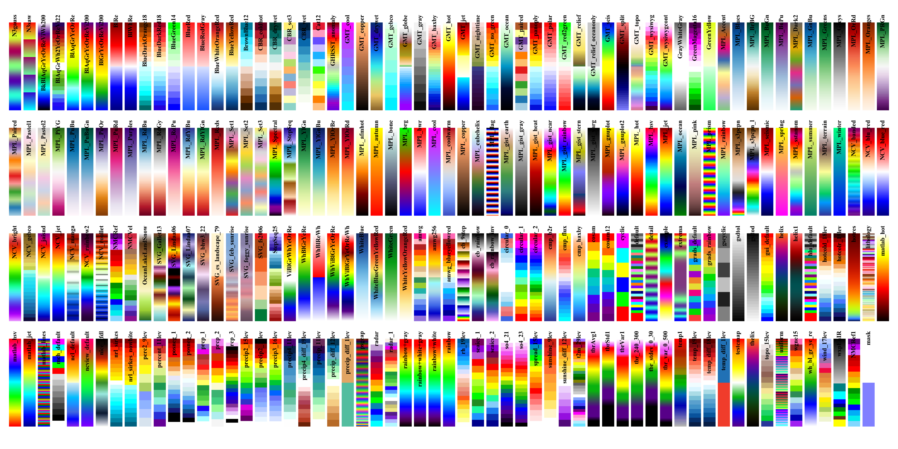

cmaps
=====

Make it easier to use user defined colormaps in matplotlib. Default colormaps are from NCL_ website.

.. _NCL: http://www.ncl.ucar.edu/Document/Graphics/color_table_gallery.shtml

Users can define a environmental variable CMAP_DIR pointing to the folder containing the self-defined rgb files.

Special thanks to Dr. Shen_: for suggestions and the help of uploading this package to Pypi and anaconda cloud.

.. _Shen: https://github.com/wqshen

Installation::

    pip install cmaps

or::

    conda install -c hhuangwx cmaps

or::
    
    git clone https://github.com/hhuangwx/cmaps.git
    cd cmaps
    python setup.py install

Usage::

    import matplotlib.pyplot as plt
    import cmaps
    import numpy as np

    x = y = np.arange(-3.0, 3.01, 0.05)
    X, Y = np.meshgrid(x, y)

    sigmax = sigmay = 1.0
    mux = muy = sigmaxy=0.0

    Xmu = X-mux
    Ymu = Y-muy

    rho = sigmaxy/(sigmax*sigmay)
    z = Xmu**2/sigmax**2 + Ymu**2/sigmay**2 - 2*rho*Xmu*Ymu/(sigmax*sigmay)
    denom = 2*np.pi*sigmax*sigmay*np.sqrt(1-rho**2)
    Z = np.exp(-z/(2*(1-rho**2))) / denom

    plt.pcolormesh(X,Y,Z,cmap=cmaps.WhiteBlueGreenYellowRed)
    plt.colorbar()

List the colormaps using the code in the examples::

    import cmaps
    import numpy as np
    import inspect

    import matplotlib.pyplot as plt
    import matplotlib
    matplotlib.rc('text', usetex=False)

    def list_cmaps():
        attributes = inspect.getmembers(cmaps, lambda _: not (inspect.isroutine(_)))
        colors = [_[0] for _ in attributes if
                  not (_[0].startswith('__') and _[0].endswith('__'))]
        return colors

    if __name__ == '__main__':
        color = list_cmaps()

        a = np.outer(np.arange(0, 1, 0.001), np.ones(10))
        plt.figure(figsize=(20, 20))
        plt.subplots_adjust(top=0.95, bottom=0.05, left=0.01, right=0.99)
        ncmaps = len(color)
        nrows = 8
        for i, k in enumerate(color):
            plt.subplot(nrows, ncmaps // nrows + 1, i + 1)
            plt.axis('off')
            plt.imshow(a, aspect='auto', cmap=getattr(cmaps, k), origin='lower')
            plt.title(k, rotation=90, fontsize=10)
            plt.title(k, fontsize=10)
        plt.savefig('colormaps.png', dpi=300)
